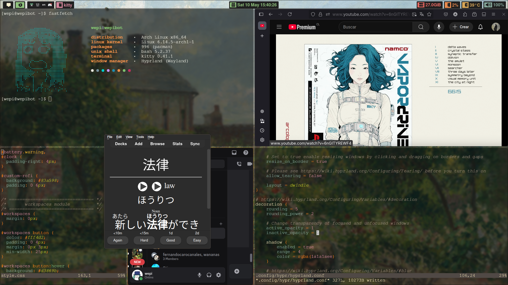

# wepi.dotfiles
dot.files(arch)

# Hyprland setup

# Nvim colors
i used vimplug for the setup of the gruvbox_theme and colors, you can also add color commands like '<red> red </red>'

# Wallpaper

Took it from Jvschulz from youtube, its the the artist's garden at eragny from camille pissarro, very nice to look at while studying and working.

