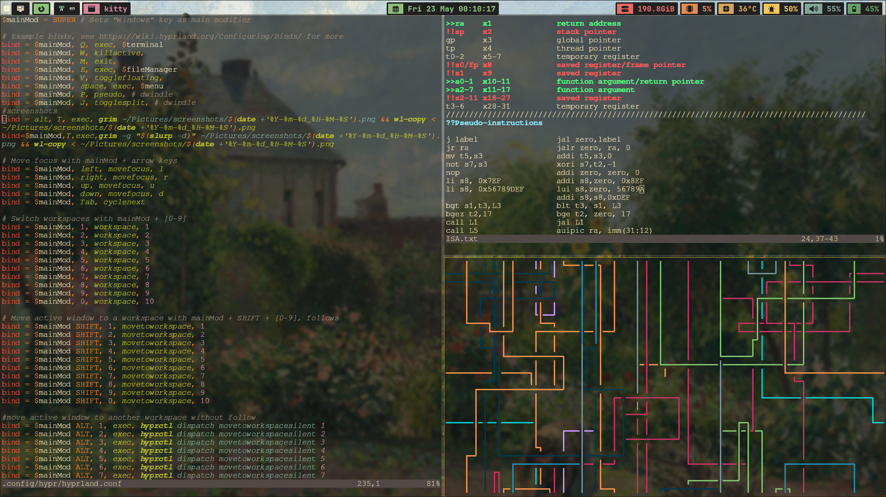

# wepi.dotfiles
These are my dotfiles for my Arch Hyprland setup.

## Tools I Use

- Hyprland (*Wayland window manager*)
- Neovim (*Text editor*)
- Kitty (*Terminal*)
- Waybar (*Status bar*)
- Wofi (*Menu*)
- Mako (*Notification daemon*)
- Ranfer (*File manager*)
## Apps

- Mozc, ibus (*Japanese and spanish input*)
- Ristretto (*Image viewer*)
- OBS (*OBS lmao*)
- Anki (*Flashcards*)
- Kicad (*board stuff*)

# Hyprland setup

# Nvim colors
i used vimplug for the setup of the gruvbox_theme and colors, you can also add color commands like '<red> red </red>'

# Wallpaper

Took it from Jvschulz on youtube, its the the artist's garden at eragny from camille pissarro, very nice to look at while studying and working.

